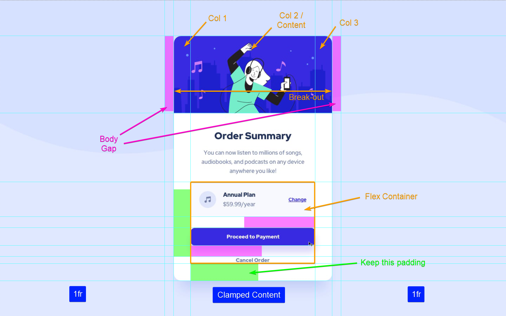

# JeffLangTech - Recipe page solution

This is a solution to the [Recipe page challenge on Frontend Mentor](https://www.frontendmentor.io/challenges/recipe-page-KiTsR8QQKm). 

## Table of contents

- [Overview](#overview)
  - [The challenge](#the-challenge)
  - [Preview](#preview)
  - [Links](#links)
- [My process](#my-process)
  - [Built with](#built-with)
  - [Step by step](#step-by-step)
  - [Continued development](#continued-development)
  - [Useful resources](#useful-resources)
- [Author](#author)

## Overview

### Preview


Not pixel perfect, but the designs also didn't facilitate that, and it's good to eyeball things from time to time anyway.

### Links

- Solution URL: [FrontEnd Mentor Solution](https://www.frontendmentor.io/solutions/grid-and-flex-combined---built-small-to-large-bwyZBSWBhj)
- Live Site URL: [Github](https://jefflangtech.github.io/order-summary-component/)

## My process

### Built with

- Semantic HTML5 markup
- CSS custom properties
- CSS Grid

### Step by step

This time I went small to big, and used some utility classes for styling. I don't like how it came out, necessarily, and my HTML and CSS just ended up feeling clunky. But it was good to get practice.

I find it helpful to markup a screenshot of the design:



Again setup my nested grid containers, which really work fantastic when the screen size shrinks. Virtually no breakpoints to deal with in terms of width sizing. 

```css
body {
  display: grid;
  grid-template-columns: 
    minmax(1px, 1fr)
    [container-start] clamp(20.44rem, 87.2%, 28.125rem) [container-end]
    minmax(1px, 1fr);
  grid-template-rows: 1fr auto 1fr;
}

body > * {
  grid-column: container-start / container-end;
  grid-row: 2;
}

main {
  display: grid;
  grid-template-columns: 
    1fr 
    [content-start] clamp(17.44rem, 85%, 22.125rem) [content-end]
    1fr;
  grid-template-rows: auto;
  row-gap: 1.1rem;
  padding-bottom: 2.625rem;
}
```

### Continued development

I'll do some research into what good implementations of CSS utility classes look like and try that for the next challenge.

### Useful resources

- [Kevin Powell: 3 underused CSS Grid Features](https://www.youtube.com/watch?v=ciuZJE74wBA) - This wasn't the original video I saw, but he does still explain how to manipulate content across grid columns using named grid lines. I used this to break out the hero image in the mobile view.

## Author

- Website - [JeffLangTech](https://jefflangtech.github.io/)
- Frontend Mentor - [@jefflangtech](https://www.frontendmentor.io/profile/jefflangtech)